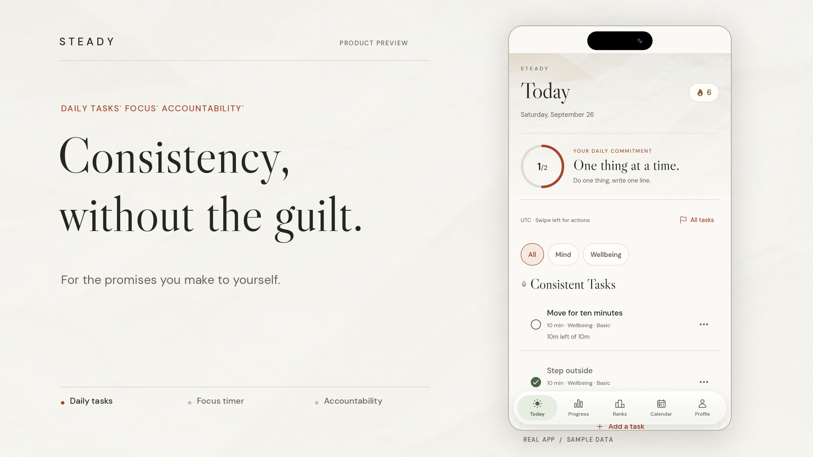

# Steady

**Consistency, without the guilt.** Private daily tasks, focused work, and an optional consistency challenge with someone who keeps you accountable.

Steady is a mobile-first Expo app with a Hono API and a React web companion. The current interface pairs textured paper, editorial type, terracotta and sage accents, Light/Dark/Auto themes, and a floating glass tab bar.

## Watch the original launch video

[](./docs/media/steady-launch.mp4)

**[Watch the first launch video](./docs/media/steady-launch.mp4)** · 20 seconds · 1080p · music, no narration

This is the original September 26, 2026 cut, not the second version. It uses fictional demo data and shows the interface as it existed when recorded; later changes are documented below.

## Three ways to use Steady

| Area | Purpose | Rules |
| --- | --- | --- |
| **Consistent Tasks** | Private Basic tasks on Today | Monthly commitments, daily completion notes, optional focus time. Basic task details stay private. |
| **Consistency challenge** | Challenge tasks on the commitment page | Accepted accountability contact required. Complete tasks directly on the commitment page; task titles and notes are not shared with the contact. |
| **To-dos** | Everyday tasks without streak pressure | One-off or recurring, optional dates/reminders/focus time, no mandatory completion note, separate from commitment streaks. |

On Today, the active-Challenge link appears below the Consistent Tasks list: **“Want to challenge your consistency?”**, followed by **“Open consistency challenge”**. Profile opens the same commitment page.

## Features

- **Monthly commitment rules.** Up to 10 tasks across Basic and Challenge in a month. Confirmed tasks cannot be deleted. Locked focus duration can increase, not decrease; locked titles cannot be silently replaced.
- **Add to an active challenge.** Add a commitment task from the commitment page. It starts today and can be completed immediately with a note. Its first partial day is exempt from missed-day email eligibility, not from task visibility or completion.
- **Explicit start today.** Eligible scheduled Challenge commitments can be started through an explicit action. Opening a future commitment does not activate it automatically.
- **Daily notes and history.** Commitment completion requires a note of at least 10 characters. Completion, undo, streaks and calendar history use the profile's local date.
- **Focus.** Per-task countdowns, pause/stop, saved remaining time and task-specific photos. Focus stays dark. Existing saved sessions retain their remaining-time behavior when a target duration is increased.
- **Voice-assisted entry.** Contextual microphone controls for tasks, to-dos and notes, typed fallback, draft review before saving, and retry-safe task creation. Availability depends on browser/device support and configured AI access.
- **Planning and reminders.** Categories, recurring to-dos, calendar day details and device-local reminders. Browser previews do not provide native notification scheduling.
- **Progress.** Computed streaks, consistency views, badges, and mode/task-band leaderboards with opt-out.
- **Accountability by consent.** Invite a contact by email. They can Accept, Decline or Stop emails in a browser without installing Steady or creating an account. Viewing an invitation is not consent.
- **Private status sharing.** Contacts receive high-level Challenge status, not task names, notes or Basic-task details.
- **Owner database console.** `/admin` is gated by `ADMIN_KEY` and can browse tables or execute SQL. Treat it as privileged database access, not an ordinary user screen.

### Important: missed-day emails are not a midnight scheduler

The current implementation checks **yesterday in each owner's timezone** when Today traffic triggers the server sweep, at most once per 15 minutes per server process. It is not a cron job. Quiet periods can skip alerts; delivery at 00:00 UTC or any fixed local time is not guaranteed.

An alert requires an eligible missed Challenge day, an accepted relationship, explicit versioned consent, an eligible rollout date and no recipient suppression. New commitment tasks do not trigger a missed email for their partial first day. Unique owner/date claims prevent duplicate attempts; uncertain sends are not blindly retried.

The current trial uses Gmail SMTP. Resend remains supported through explicit configuration. SMTP acceptance, inbox receipt and automatic-trigger correctness are separate checks. See [email setup](./EMAIL_SETUP.md).

## Stack and repository

| Layer | Implementation |
| --- | --- |
| Mobile | Expo SDK 54, React Native, expo-router, TanStack Query, AsyncStorage |
| Web | React 19, Vite, Wouter |
| API | Bun, Hono, typed oRPC at `/api/rpc/*` |
| Data | Turso/libSQL through Drizzle ORM |
| Authentication | Better Auth email/password, Expo bearer sessions, managed auth integration |
| Email | Explicit Gmail SMTP or Resend provider |
| Desktop | Existing Electron shell around the web companion |
| Tooling | Bun workspaces, Turborepo, TypeScript |

```text
packages/
  mobile/
    app/                 # Today, Progress, Ranks, Calendar, Profile, commitment, Focus
    components/          # Shared task sheets, notes, voice controls and paper UI
    lib/                 # Focus storage, reminders, fonts and voice state
    queries/             # Typed API hooks
  web/
    src/api/
      routes/            # User-scoped procedures, recipient actions, admin
      lib/               # Dates, streaks, commitment activation and additions
      services/          # Email, invitation delivery, consent and missed-day sweep
      database/          # Application/auth schema and managed client
    src/shared/          # Recurrence and assistant draft rules with tests
    src/web/             # Web companion, /invitation and /admin
    migrations/          # Reviewed standalone additive SQL
  desktop/               # Electron shell
README.md
EMAIL_SETUP.md
database-guide.md        # Database safety and migration guidance
docs/build-log.md        # Development history and current limitations
docs/media/              # Original launch video and poster
```

The project uses free-tier-friendly services, but this repository does not guarantee zero cost. Hosting, database, AI, email and build usage depend on each provider and account configuration.

## Getting started

Use Bun as specified in `package.json`. This is a managed Runable project: keep its assigned ports, managed files and existing Expo identity intact.

```bash
git clone https://github.com/Abhinavinnovations/Steady.git
cd Steady
bun install
cp .env.template .env
```

Fill in the **single root `.env`**, never commit real credentials:

| Configuration | Purpose |
| --- | --- |
| `DATABASE_URL`, `DATABASE_AUTH_TOKEN` | Your Turso database; see the migration guidance before changing populated data |
| `BETTER_AUTH_SECRET`, `WEBSITE_URL` | Authentication secret and actual web/API origin |
| `APPLICATION_ID`, `VITE_RUNABLE_AUTH_ISSUER` | Existing managed authentication configuration |
| `ADMIN_KEY` | Optional privileged database-console key; leaving it blank disables access |
| `AI_GATEWAY_BASE_URL`, `AI_GATEWAY_API_KEY` | Voice/assistant parsing when using the configured gateway |
| Email provider and feature flags | See [EMAIL_SETUP.md](./EMAIL_SETUP.md); the template defaults to disabled invitation/alert delivery |

The mobile client uses `expo.extra.apiUrl` first and `EXPO_PUBLIC_API_URL` only as a fallback. Check the effective URL when working from a clone so you do not accidentally point a test build at an existing live backend. Never place server credentials in Expo public fields.

Run these in separate terminals from the repository root:

```bash
bun run dev          # Web and API
bun run dev:mobile   # Expo mobile preview
```

Ports come from `__ports.cjs` and the managed configuration. Do not hardcode replacement ports or edit template plumbing. Provisioning and managed authentication settings are required for a standalone clone; copying the blank environment template alone does not provide them.

### Checks

```bash
bun run typecheck
bun run lint
bun run build
bun test packages/mobile/lib packages/web/src/shared
```

The root build covers the web/desktop build tasks, not an installable mobile release. For mobile distribution, use the mobile preview's Publish workflow and connect your Expo account there. Browser checks do not replace physical-device testing.

## Data and operational safety

- Keep all database credentials, mail credentials, auth secrets and admin keys server-side.
- User-facing procedures enforce ownership; recipient capability endpoints and the separately key-gated admin console have different authorization models. This is application-layer authorization, not database row-level security.
- Back up and verify populated databases before any schema change. Do not use `db:push` as a blind production upgrade.
- The SQL in `packages/web/migrations/` is separate from Drizzle's generated migration journal. Do not assume `db:migrate` applies those files.
- Keep private backups, recipient links, real-user screenshots, test inboxes, `.env`, local scratchpads and generated build output out of Git.
- Pushing to GitHub does not publish the app or change live account data.

## Documentation

- [Email setup, consent and delivery behavior](./EMAIL_SETUP.md)
- [Database model, migrations and admin safety](./database-guide.md)
- [Build history and known limits](./docs/build-log.md)
- [Web/API package](./packages/web/README.md)
- [Design direction](./design.md)

The broader explanatory-copy proposal remains unapplied. This update documents the implemented app; it does not silently apply that proposal.

---

Built by **Abhinavinnovations** (EAM LLC · HPAOC2016™).
